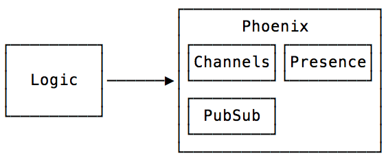
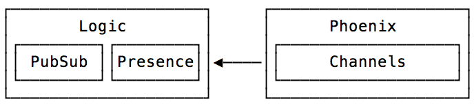

# Mithril.PubSub

PubSub and Presence implementations that don't create a dependency between your
business logic and your Phoenix web app.

## Why

Phoenix 1.3 and higher encourages us to keep our business logic separate from our
Phoenix web application. PubSub topics, event handling, and presence **are often 
core business logic concerns**.

The current architecture of Phoenix forces your business logic to call 
`Phoenix.Endpoint` to broadcast events to websockets. Presence information about
a topic is likewise tied up in a web app `Presence` module.

This makes your business logic depend on your Phoenix application, rather
than the other way around.



`Mithril.PubSub` allows you to reverse that dependency, making your
Phoenix app, Endpoint, and Channels depend on your business logic instead.



## Included Modules

Read their documentation for more information.

- `Mithril.PubSub`
- `Mithril.PubSub.Subscriber`
- `Mithril.Presence`

## How It Works

Phoenix has already extracted its PubSub and CRDT-based presence tracking 
system to a small package called [phoenix_pubsub][pp]. Sadly, 
`Phoenix.Presence` is not in this package, because it relies on 
Phoenix-specific data types, such as `Phoenix.Socket.Message` and 
`Phoenix.Socket.Broadcast`.

However, `Phoenix.Presence` is only a tiny wrapper around `Phoenix.Tracker`,
which _is_ part of [phoenix_pubsub][pp].

It was therefore very easy to fork `Phoenix.Presence` to remove its reliance
on Phoenix-only data-types, producing `Mithril.Presence`.

Likewise, `Mithril.PubSub` is a lightweight wrapper around `Phoenix.PubSub`.

## Installation

If [available in Hex](https://hex.pm/docs/publish), the package can be installed
by adding `mithril_pubsub` to your list of dependencies in `mix.exs`:

```elixir
def deps do
  [
    {:mithril_pubsub, "~> 0.1.0"}
  ]
end
```

Documentation can be generated with [ExDoc](https://github.com/elixir-lang/ex_doc)
and published on [HexDocs](https://hexdocs.pm). Once published, the docs can
be found at [https://hexdocs.pm/mithril_pubsub](https://hexdocs.pm/mithril_pubsub).

[pp]: https://hexdocs.pm/phoenix_pubsub